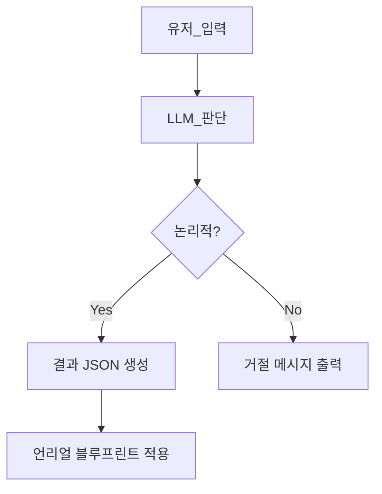

좋아! 언리얼팀 팀원들에게 **발더스 게이트**와 **TRPG**, 그리고 여기에 **생성형 AI를 어떻게 접목할 수 있는지** 쉽게 이해시킬 수 있도록 아래와 같이 정리해볼게.  
언리얼 개발자들이 바로 이해할 수 있도록 **개념 + 사례 + 기술 적용 포인트**로 구성했어.  
필요하면 PDF나 프레젠테이션용으로도 정리해줄 수 있어!

---

# 🎮 [프로젝트 참고 자료] 발더스 게이트, TRPG, 생성형 AI 활용 개요

---

## 1️⃣ 발더스 게이트란?

### 🔍 개요
- **장르**: 클래식 스타일의 **턴제 전략 RPG** 게임
- **특징**:
    - **깊이 있는 서사와 선택지**
    - **NPC와의 상호작용 중심 스토리 진행**
    - **TRPG 룰 (D&D 기반)**을 디지털로 구현
    - 수많은 **분기, 조합, 대화 선택** → 플레이어의 자유도 강조

### 🎯 핵심 포인트
- 유저는 **자유롭게 세상을 탐험하고, 상호작용하고, 선택을 통해 세계에 영향을 줌**
- **마치 실제 TRPG를 플레이하는 느낌**을 디지털로 재현한 게임

---

## 2️⃣ TRPG란? (Tabletop Role-Playing Game)

### 📘 개요
- 플레이어가 캐릭터를 연기하며, **게임 마스터(GM)**가 상황을 설명하고 룰을 판정하는 **스토리 중심 게임**
- 종이, 펜, 주사위 등으로 진행되며, 상상력과 즉흥적 대화가 핵심
- [TRPG 개념 정리 위키](https://ko.wikipedia.org/wiki/TRPG)
### 🧙 역할 구성
- **플레이어**: 자신이 만든 캐릭터로 모험 수행
- **게임 마스터(GM)**: 세계를 설명하고, 결과를 판정하며, 스토리를 주도

### 🎮 디지털화 예시
- 발더스 게이트 = TRPG의 **자동화된 디지털 형태**
- GM의 역할 일부를 게임 시스템 또는 AI가 맡음

---

## 3️⃣ 왜 생성형 AI가 중요한가?

### 💡 생성형 AI = 디지털 게임 마스터
- GPT 계열 모델, LLaMA, Claude 등 LLM은 자연어를 이해하고 **즉흥적인 반응과 창작**이 가능
- 게임 내 세계의 룰과 반응을 **유저의 입력에 따라 동적으로 만들어냄**

---

## 4️⃣ AI를 활용한 게임 확장 예시

| 기능                | 예시                                                   | 기술 적용 방식                     |
| ----------------- | ---------------------------------------------------- | ---------------------------- |
| 🎭 자연어 기반 NPC 대화  | “이 마을에 재밌는 일 있어?”(유저)                                | LLM + 대화 컨텍스트 관리             |
| 🧠 유저 정의 이벤트 생성   | “그 의자는 사실 함정이었다.”(유저) → 트랩 생성                        | LLM → JSON 이벤트 파싱 → 블루프린트 연결 |
| 🌟 상호작용 기반 발견 이벤트 | “바위를 문지른다”(유저) → 바위에서 빛이 나며 티타늄으로 변했다.(AI) -> 아이템 생성 | LLM 논리 판단 → 아이템 스폰           |
| 🎲 동적 퀘스트         | “늑대가 장로를 납치했다.”(유저) → 미션 생성(AI)                      | 자연어 입력 기반 퀘스트 템플릿 활용         |
| 🧾 플레이 일지 요약      | “최근 뭐했더라?” → 스토리 요약 출력                               | 플레이 로그 + 요약 LLM 처리           |
| 🧰 지형/아이템 조작      | “이 지역은 미끄럽다.” → 물리 효과 적용                             | 트리거/물리 속성 자동 수정              |

---

## 5️⃣ 언리얼에서 적용 가능한 구조

### 💡 기본 구조 흐름

### 🎮 언리얼 적용 요소 예시

- Trigger Volume
- Actor Spawner
- Character Movement 조작
- UMG로 대화창 / 입력창
- Niagara 이펙트
- AIController + Behavior Tree
- Level Sequence

---

## 6️⃣ 팀원들이 이해하면 좋은 포인트

|구분|핵심 이해 포인트|
|---|---|
|**기획/스토리**|“유저가 말로 세계를 바꾼다” → 자유도 중심 RPG|
|**개발자**|자연어 → 구조화 → 언리얼 액션 매핑 프로세스|
|**레벨 디자이너**|AI GM이 환경/이벤트/대사까지 생성함으로써 콘텐츠 다양화 가능|
|**UX/UI**|콘솔창, 반응형 입력창, 생성된 이벤트 피드백 등 설계 필요|

---

## ✨ 정리

- **발더스 게이트 = 디지털 TRPG의 대표작**
- **TRPG의 핵심은 상호작용과 자유도**
- **생성형 AI는 TRPG에서의 GM 역할을 자동화/확장 가능**
- **언리얼에서는 블루프린트와 Trigger 시스템으로 쉽게 구현 가능**

---

필요하다면 이걸 PDF나 프레젠테이션 슬라이드로 변환해줄 수도 있고, 팀 세션용 Q&A 문서나 데모도 만들어줄 수 있어!  
어떤 형식으로 팀원에게 공유할지 정해졌어? (Notion, 슬라이드, 문서 등)